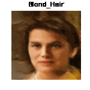

# <h1 align="center">**Controllable Generation using GANs**</h1>

 

This repository presents an implement of controllability for [GANs (Generative Adversarial Networks)](https://papers.nips.cc/paper/5423-generative-adversarial-nets.pdf) utilizing gradients from a classifier. By training a classifier to recognize specific features, we can use it to adjust the inputs of the generator and generate images with more or less of those features.

## Implementations in TensorFlow and PyTorch
Implementations have been carried out in both TensorFlow and PyTorch, the two most widely used frameworks in Deep Learning, to explore the capabilities of controllable generation in GANs. Each implementation provides insights into the differences and similarities between these frameworks, offering practical perspectives for professionals in the field.

- [TensorFlow Notebook](GANControllableGeneration_CelebA_PyTorch.ipynb)

- [PyTorch Notebook](GANControllableGeneration_CelebA_TensorFlow.ipynb)

## Dataset Setup
The ``CelebA`` dataset was employed, consisting of over 200,000 images of celebrities, each with 40 binary facial attribute annotations. The complete dataset is available for download from the [official page](https://mmlab.ie.cuhk.edu.hk/projects/CelebA.html). In case of download inconveniences, loading and data preprocessing details are provided for TensorFlow and PyTorch in their respective notebooks.

## Key Components of Controllable Generation
- A classifier is trained to label each image with one or more of the 40 available attributes, alongside a generator and a discriminator to generate images of human faces. The architectures of these three components are based on DCGAN, a direct extension of GAN that utilizes convolutional and transposed convolutional layers.

- For controllable generation, stochastic gradient ascent is employed. This method, contrary to gradient descent, seeks to maximize rather than minimize. The classifier, along with stochastic gradient ascent, is used to generate noise that allows for adjusting the presence of specific characteristics in the generated images.

## Generated Examples

 

*You can observe how face generation improves as epochs progress.*

## Examples of Controllable Generation

    

        
        
        
        
    

    

        
        
        
        
    

*With controllable generation, it is possible to add specific features to the generated face by using stochastic gradient ascent on the noise that forms the face. As the steps progress, the desired characteristic is successfully incorporated.*

## Technological Stack
 

## Contact

